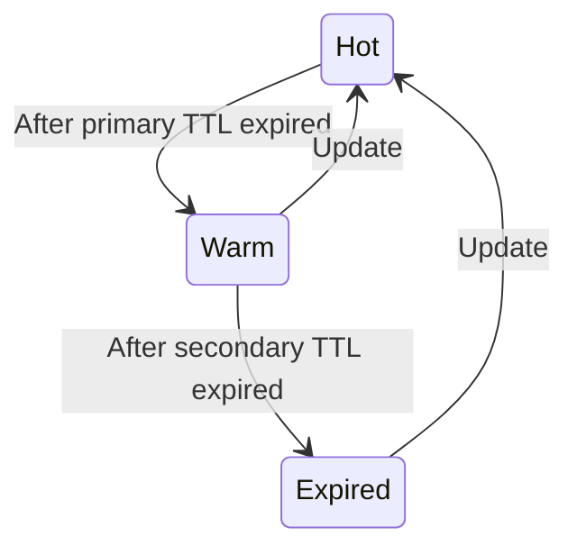
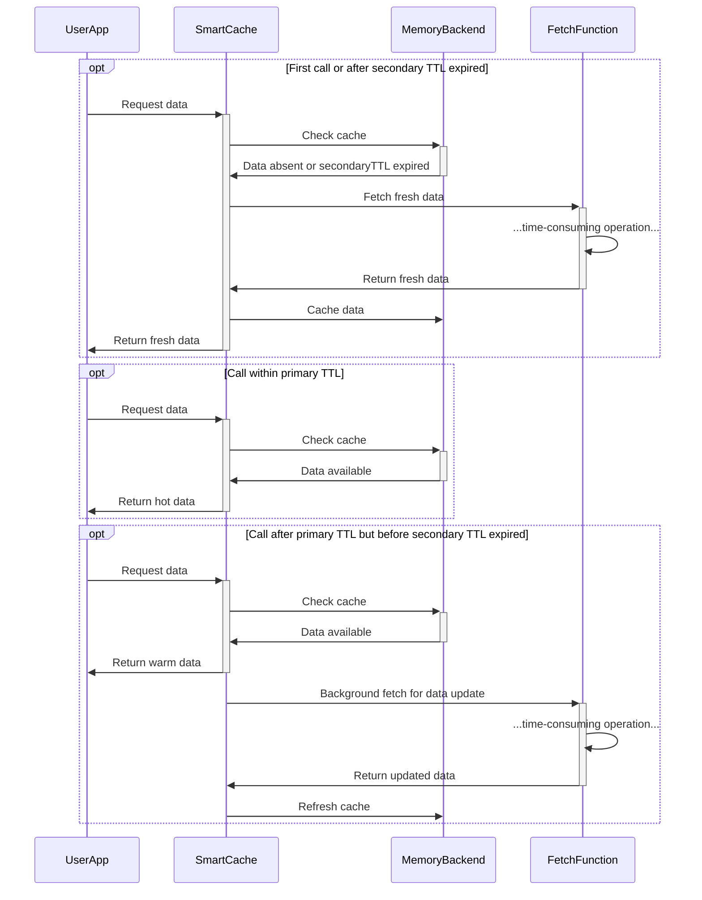

# Smart Cache   

Smart Cache introduces a caching mechanism that employs two distinct TTL (Time-To-Live) periods, designed to optimize data retrieval speed while managing data freshness.

Traditional caching often faces a dilemma: prioritize speed by serving cached data or ensure freshness by frequently fetching new data. This balance can significantly influence metrics like p95 or p99 processing times, especially when dealing with resource-intensive operations.

With Smart Cache, data within its primary TTL is returned immediately, ensuring quick access. When data surpasses the primary TTL but is still within the secondary TTL, it's served instantly, but a background update is initiated. This background update mechanism aims to improve latency metrics by reducing the immediate load of full data refreshes. However, there's a trade-off to be aware of: data served between the primary and secondary TTL might be slightly older, and the freshest data is only guaranteed on a subsequent fetch after the background update.

In essence, Smart Cache's dual-TTL approach offers a balanced solution for applications that need to maintain high-performance metrics while occasionally serving slightly older data.

To better understand the transitions between data states, check the following diagram:

## Example usage

[Check the example on go playground](https://go.dev/play/p/xjl7MwQ8Sjq)

## How it works

