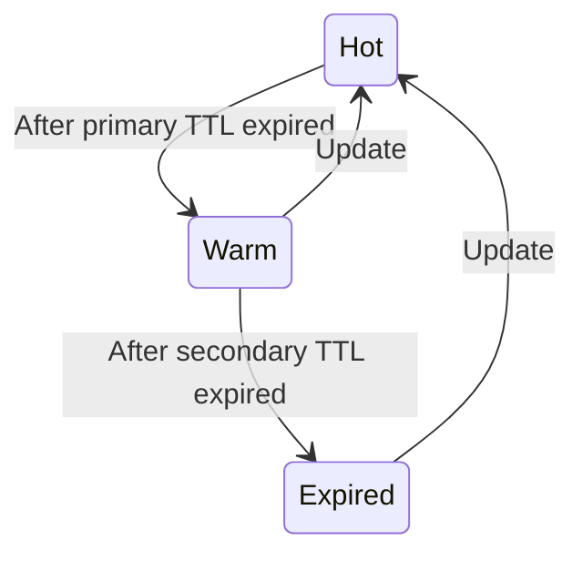
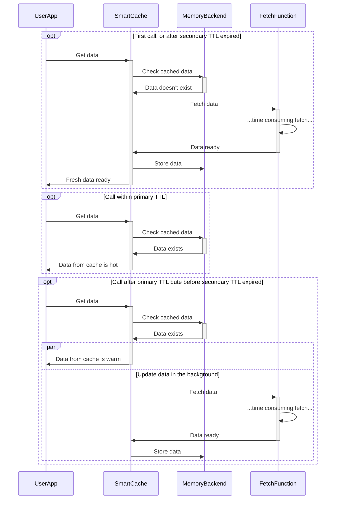

# Smart Cache  [](https://goreportcard.com/report/github.com/m-zajac/smartcache) [](http://godoc.org/github.com/m-zajac/smartcache)

Smartcache package provides a caching solution with customizable expiration policies (hot and warm data).
It is designed to optimize data retrieval by caching the results of expensive operations, such as database queries or API calls, and serving them quickly when requested.

One of the unique features of SmartCache is its dual Time-To-Live (TTL) settings:

- `Primary TTL`: This is the lifespan of a cache entry when it's still hot. During this period, entries are directly served from the cache.
- `Secondary TTL`: This is the maximum lifespan of a cache entry. Once the primary TTL expires, while the secondary TTL is still active, the entry is considered warm but not evicted. Instead, SmartCache triggers a background refresh to update the entry, while immediately returning the stale value. This ensures uninterrupted access to data, even during updates.

Here's the cache diagram:



## How it works




## Example usage

```go
	type UserProfile struct {
		ID   int
		Name string
	}

	// An example function that provides data that we want to cache.
	fetchUserProfile := func(ctx context.Context, userID string) (*UserProfile, error) {
		// Simulate a slow database query.
		time.Sleep(500 * time.Millisecond)

		// Fetch the user profile from the database.
		profile := &UserProfile{ID: 1, Name: "John Doe"}

		return profile, nil
	}

	// This will be a fetch wrapper to use for the cache.
	// It adapts our `fetchUserProfile` function to return `smartcache.FetchResult`.
	fetchAdapter := func(ctx context.Context, key string) (*smartcache.FetchResult[UserProfile], error) {
		profile, err := fetchUserProfile(ctx, key)
		if err != nil {
			return nil, err
		}

		return &smartcache.FetchResult[UserProfile]{
			Data: profile,
		}, nil
	}

	// For this example lets use small values.
	primaryTTL, secondaryTTL := time.Second, 3*time.Second

	backend, err := lru.NewBackend[UserProfile](100)
	if err != nil {
		fmt.Println("Creating cache backend:", err)
		return
	}

	cache, err := smartcache.New[UserProfile](
		backend,
		smartcache.WithTTL(primaryTTL, secondaryTTL),
	)
	if err != nil {
		fmt.Println("Creating cache:", err)
		return
	}

	ctx := context.Background()
	userID := "1"

	// Fetch the user result using the cache.
	result, _ := cache.Get(ctx, userID, fetchAdapter)
	profile := result.Data

	// Fetch the user profile using the cache again. This time it will be returned from internal memory cache.
	result, _ = cache.Get(ctx, userID, fetchAdapter)
	profile = result.Data

	// After primaryTTL duration paseses...
	time.Sleep(primaryTTL + time.Second)

	// ...cache will again return data from internal memory cache, but after that the internal value will be updated in the background.
	result, _ = cache.Get(ctx, userID, fetchAdapter)
	profile = result.Data

	// After secondaryTTL duration paseses...
	time.Sleep(primaryTTL + time.Second)

	// ...cache will fetch fresh data, store it in memory and return the value.
	result, _ = cache.Get(ctx, userID, fetchAdapter)
	profile = result.Data

	fmt.Printf("User profile: ID=%d, Name=%s\n", profile.ID, profile.Name)
	// Output: User profile: ID=1, Name=John Doe
```